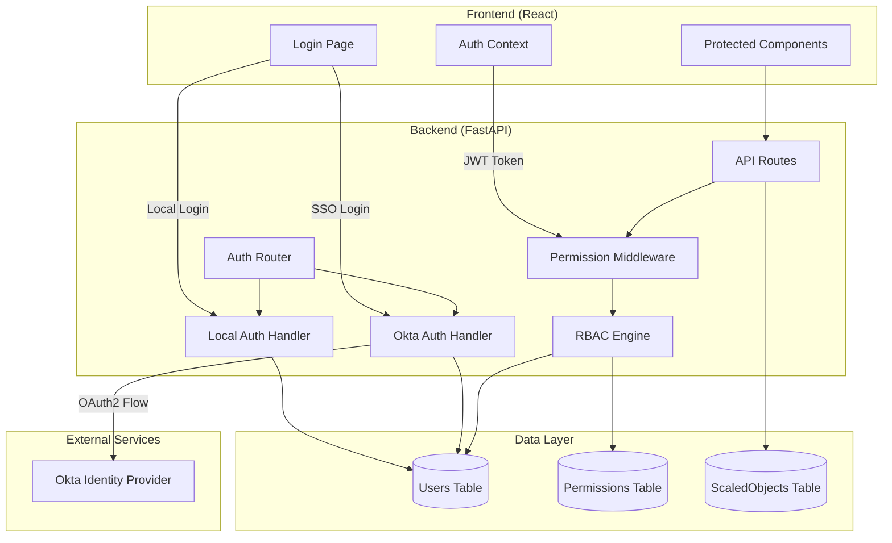
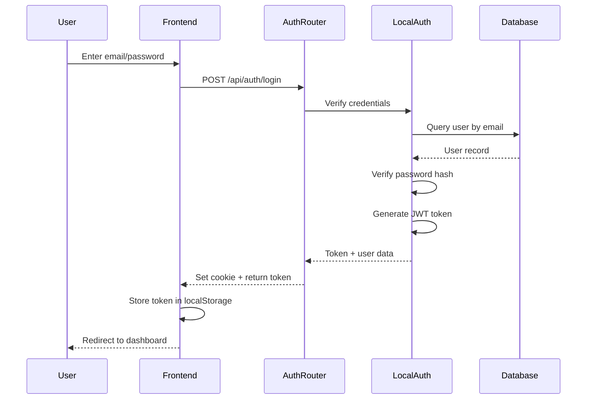
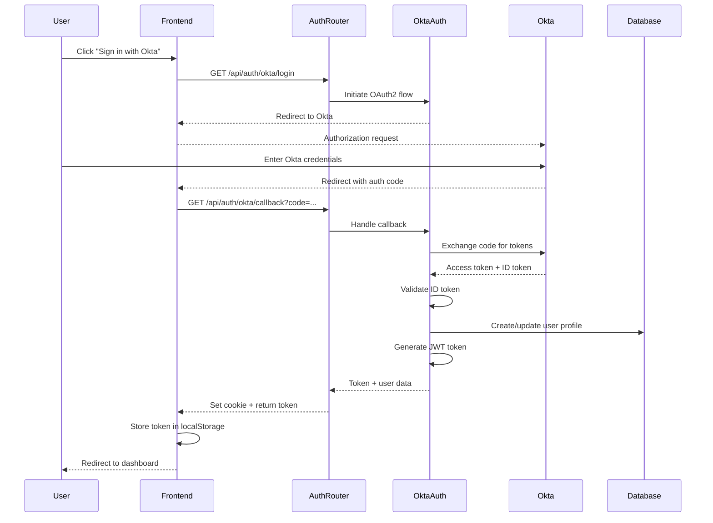
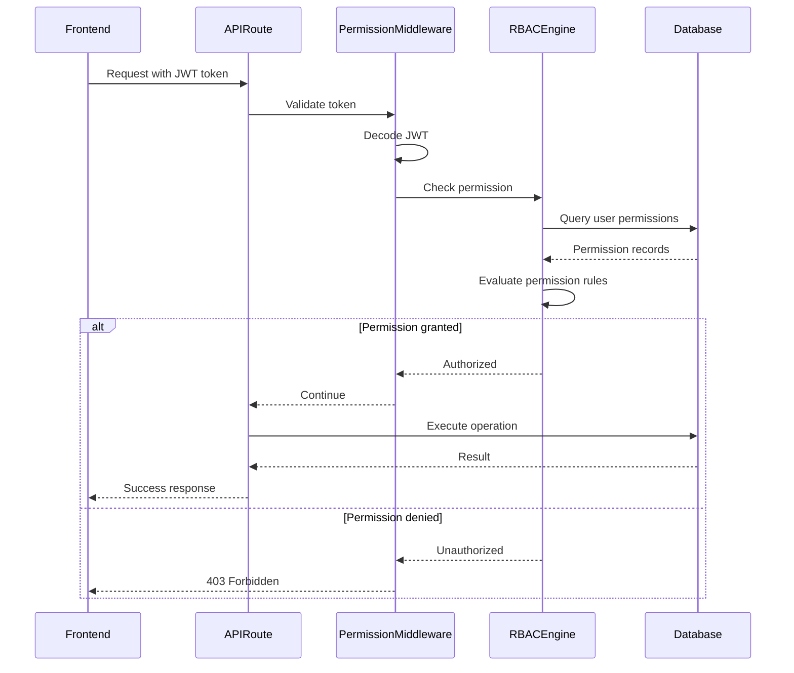

# Design Document: Okta Authentication and RBAC

## Overview

This design document specifies the technical implementation for integrating Okta SSO authentication alongside the existing local authentication system, and establishing a Role-Based Access Control (RBAC) system for fine-grained permissions on ScaledObjects.

### Design Goals

1. **Dual Authentication Support**: Enable both local username/password and Okta SSO authentication without breaking existing functionality
2. **ArgoCD Pattern**: Okta handles authentication (identity verification), application handles authorization (permission enforcement)
3. **Backward Compatibility**: Existing users and authentication flows continue to work unchanged
4. **Fine-Grained RBAC**: Support namespace-scoped and object-scoped permissions for read and write operations
5. **Zero Downtime Migration**: Deployments can upgrade without service interruption

### Key Architectural Decisions

- **Authentication Strategy**: Multi-provider authentication with provider-specific user records
- **Authorization Model**: Permission-based RBAC with namespace and object scopes
- **Token Strategy**: Continue using JWT tokens for session management, with provider-specific claims
- **Database Schema**: Extend existing user model with provider tracking and add new permissions table
- **Frontend Integration**: Conditional UI rendering based on Okta availability and user permissions

## Architecture

### System Components



### Authentication Flow

#### Local Authentication Flow



#### Okta SSO Authentication Flow



### Authorization Flow



## Components and Interfaces

### Backend Components

#### 1. Authentication Router (`backend/auth_router.py`)

**Responsibilities:**
- Route authentication requests to appropriate handlers
- Manage authentication endpoints
- Handle OAuth2 callbacks

**Endpoints:**
```python
POST   /api/auth/login              # Local authentication
POST   /api/auth/logout             # Logout (both providers)
GET    /api/auth/me                 # Get current user profile
GET    /api/auth/okta/login         # Initiate Okta OAuth2 flow
GET    /api/auth/okta/callback      # Handle Okta OAuth2 callback
POST   /api/auth/okta/refresh       # Refresh Okta access token
GET    /api/auth/config             # Get auth configuration (Okta enabled?)
```

#### 2. Local Authentication Handler (`backend/auth/local_auth.py`)

**Responsibilities:**
- Verify username/password credentials
- Hash and validate passwords using bcrypt
- Generate JWT tokens for local users

**Interface:**
```python
class LocalAuthHandler:
    async def authenticate(self, email: str, password: str) -> UserProfile:
        """Authenticate user with local credentials"""
        
    async def create_user(self, email: str, password: str, name: str) -> UserProfile:
        """Create new local user account"""
        
    def hash_password(self, password: str) -> str:
        """Hash password using bcrypt"""
        
    def verify_password(self, plain: str, hashed: str) -> bool:
        """Verify password against hash"""
```

#### 3. Okta Authentication Handler (`backend/auth/okta_auth.py`)

**Responsibilities:**
- Implement OAuth2 authorization code flow
- Validate Okta ID tokens
- Synchronize user profiles from Okta claims
- Manage refresh tokens

**Interface:**
```python
class OktaAuthHandler:
    def __init__(self, config: OktaConfig):
        """Initialize with Okta configuration"""
        
    def get_authorization_url(self, state: str) -> str:
        """Generate Okta authorization URL"""
        
    async def exchange_code_for_tokens(self, code: str) -> OktaTokens:
        """Exchange authorization code for access/ID tokens"""
        
    async def validate_id_token(self, id_token: str) -> dict:
        """Validate ID token signature and claims"""
        
    async def get_user_info(self, access_token: str) -> dict:
        """Fetch user info from Okta userinfo endpoint"""
        
    async def refresh_access_token(self, refresh_token: str) -> OktaTokens:
        """Refresh access token using refresh token"""
        
    async def sync_user_profile(self, okta_claims: dict) -> UserProfile:
        """Create or update user profile from Okta claims"""
```

#### 4. RBAC Engine (`backend/rbac/engine.py`)

**Responsibilities:**
- Evaluate permission rules
- Check user permissions against requested actions
- Handle namespace and object-scoped permissions

**Interface:**
```python
class RBACEngine:
    async def check_permission(
        self, 
        user_id: str, 
        action: PermissionAction,  # READ or WRITE
        resource_type: str,         # "scaledobject"
        namespace: str,
        object_name: Optional[str] = None
    ) -> bool:
        """Check if user has permission for action on resource"""
        
    async def filter_objects_by_permission(
        self,
        user_id: str,
        objects: List[ScaledObject],
        action: PermissionAction
    ) -> List[ScaledObject]:
        """Filter objects list to only those user can access"""
        
    async def get_user_permissions(self, user_id: str) -> List[Permission]:
        """Get all permissions for a user"""
        
    async def grant_permission(
        self,
        user_id: str,
        action: PermissionAction,
        scope: PermissionScope,  # NAMESPACE or OBJECT
        namespace: str,
        object_name: Optional[str] = None
    ) -> Permission:
        """Grant a permission to a user"""
        
    async def revoke_permission(self, permission_id: str) -> bool:
        """Revoke a permission"""
```

#### 5. Permission Middleware (`backend/rbac/middleware.py`)

**Responsibilities:**
- Intercept API requests
- Extract user from JWT token
- Enforce permission checks before route handlers

**Interface:**
```python
def require_permission(
    action: PermissionAction,
    resource_type: str,
    namespace_param: str = "namespace",
    object_param: Optional[str] = None
):
    """Decorator to require permission for route"""
    
async def get_current_user_with_permissions(request: Request) -> UserWithPermissions:
    """Dependency to get current user with permissions loaded"""
```

### Frontend Components

#### 1. Enhanced Login Page (`frontend/src/pages/LoginPage.js`)

**Responsibilities:**
- Display local login form
- Display Okta SSO button (if enabled)
- Handle authentication errors
- Redirect after successful authentication

**Props/State:**
```typescript
interface LoginPageState {
  email: string;
  password: string;
  error: string;
  loading: boolean;
  oktaEnabled: boolean;
}
```

#### 2. Enhanced Auth Context (`frontend/src/contexts/AuthContext.js`)

**Responsibilities:**
- Manage authentication state
- Store user profile and permissions
- Provide authentication methods
- Handle token refresh

**Interface:**
```typescript
interface AuthContextValue {
  user: UserProfile | null;
  permissions: Permission[];
  loading: boolean;
  login: (email: string, password: string) => Promise<void>;
  loginWithOkta: () => void;
  logout: () => Promise<void>;
  checkAuth: () => Promise<void>;
  hasPermission: (action: string, namespace: string, objectName?: string) => boolean;
}
```

#### 3. Permission-Aware Components

**Responsibilities:**
- Conditionally render UI elements based on permissions
- Hide/disable actions user cannot perform

**Example:**
```typescript
interface PermissionGateProps {
  action: 'read' | 'write';
  namespace: string;
  objectName?: string;
  children: React.ReactNode;
  fallback?: React.ReactNode;
}

function PermissionGate({ action, namespace, objectName, children, fallback }: PermissionGateProps) {
  const { hasPermission } = useAuth();
  
  if (!hasPermission(action, namespace, objectName)) {
    return fallback || null;
  }
  
  return <>{children}</>;
}
```

#### 4. Admin Permission Management UI (`frontend/src/pages/AdminPermissionsPage.js`)

**Responsibilities:**
- List all users
- Display user permissions
- Add/remove permissions
- Validate permission inputs

**Components:**
- `UserList`: Display all users with permission counts
- `UserPermissionDetail`: Show and edit permissions for a user
- `PermissionForm`: Form to add new permission
- `PermissionList`: Display existing permissions with delete action

## Data Models

### Database Schema

#### Extended Users Table

```sql
CREATE TABLE users (
    id VARCHAR(36) PRIMARY KEY,
    email VARCHAR(255) UNIQUE NOT NULL,
    password_hash VARCHAR(255),  -- NULL for Okta users
    name VARCHAR(255) NOT NULL,
    role VARCHAR(50) DEFAULT 'user',  -- 'user' or 'admin'
    auth_provider VARCHAR(50) DEFAULT 'local',  -- 'local' or 'okta'
    okta_subject VARCHAR(255),  -- Okta 'sub' claim for linking
    created_at TIMESTAMP DEFAULT CURRENT_TIMESTAMP,
    updated_at TIMESTAMP DEFAULT CURRENT_TIMESTAMP,
    INDEX idx_email (email),
    INDEX idx_okta_subject (okta_subject)
);
```

**Migration Strategy:**
- Add new columns with defaults
- Existing users get `auth_provider='local'`
- `password_hash` remains NOT NULL for existing users, nullable for new Okta users

#### New Permissions Table

```sql
CREATE TABLE permissions (
    id VARCHAR(36) PRIMARY KEY,
    user_id VARCHAR(36) NOT NULL,
    action VARCHAR(20) NOT NULL,  -- 'read' or 'write'
    scope VARCHAR(20) NOT NULL,  -- 'namespace' or 'object'
    namespace VARCHAR(255) NOT NULL,
    object_name VARCHAR(255),  -- NULL for namespace scope
    created_at TIMESTAMP DEFAULT CURRENT_TIMESTAMP,
    created_by VARCHAR(36),  -- Admin user who granted permission
    FOREIGN KEY (user_id) REFERENCES users(id) ON DELETE CASCADE,
    INDEX idx_user_id (user_id),
    INDEX idx_namespace (namespace),
    INDEX idx_user_namespace (user_id, namespace),
    UNIQUE KEY unique_permission (user_id, action, scope, namespace, object_name)
);
```

**Constraints:**
- `action` must be 'read' or 'write'
- `scope` must be 'namespace' or 'object'
- If `scope='object'`, `object_name` must be NOT NULL
- If `scope='namespace'`, `object_name` must be NULL
- Unique constraint prevents duplicate permissions

#### New Okta Tokens Table (Optional - for refresh token storage)

```sql
CREATE TABLE okta_tokens (
    id VARCHAR(36) PRIMARY KEY,
    user_id VARCHAR(36) NOT NULL,
    refresh_token TEXT NOT NULL,
    expires_at TIMESTAMP NOT NULL,
    created_at TIMESTAMP DEFAULT CURRENT_TIMESTAMP,
    FOREIGN KEY (user_id) REFERENCES users(id) ON DELETE CASCADE,
    INDEX idx_user_id (user_id)
);
```

### SQLAlchemy ORM Models

#### UserModel (Extended)

```python
class UserModel(Base):
    __tablename__ = "users"
    
    id = Column(String, primary_key=True, default=lambda: str(uuid.uuid4()))
    email = Column(String, unique=True, nullable=False, index=True)
    password_hash = Column(String, nullable=True)  # Changed to nullable
    name = Column(String, nullable=False)
    role = Column(String, default="user")
    auth_provider = Column(String, default="local")  # NEW
    okta_subject = Column(String, nullable=True, index=True)  # NEW
    created_at = Column(DateTime, default=lambda: datetime.now())
    updated_at = Column(DateTime, default=lambda: datetime.now(), onupdate=lambda: datetime.now())
    
    # Relationships
    permissions = relationship("PermissionModel", back_populates="user", cascade="all, delete-orphan")
```

#### PermissionModel (New)

```python
class PermissionModel(Base):
    __tablename__ = "permissions"
    
    id = Column(String, primary_key=True, default=lambda: str(uuid.uuid4()))
    user_id = Column(String, ForeignKey("users.id", ondelete="CASCADE"), nullable=False)
    action = Column(String, nullable=False)  # 'read' or 'write'
    scope = Column(String, nullable=False)  # 'namespace' or 'object'
    namespace = Column(String, nullable=False)
    object_name = Column(String, nullable=True)
    created_at = Column(DateTime, default=lambda: datetime.now())
    created_by = Column(String, nullable=True)
    
    # Relationships
    user = relationship("UserModel", back_populates="permissions")
    
    # Constraints
    __table_args__ = (
        Index('idx_user_id', 'user_id'),
        Index('idx_namespace', 'namespace'),
        Index('idx_user_namespace', 'user_id', 'namespace'),
        UniqueConstraint('user_id', 'action', 'scope', 'namespace', 'object_name', 
                        name='unique_permission'),
    )
```

#### OktaTokenModel (New - Optional)

```python
class OktaTokenModel(Base):
    __tablename__ = "okta_tokens"
    
    id = Column(String, primary_key=True, default=lambda: str(uuid.uuid4()))
    user_id = Column(String, ForeignKey("users.id", ondelete="CASCADE"), nullable=False)
    refresh_token = Column(Text, nullable=False)
    expires_at = Column(DateTime, nullable=False)
    created_at = Column(DateTime, default=lambda: datetime.now())
```

### Pydantic Schemas

#### Authentication Schemas

```python
class LoginRequest(BaseModel):
    email: str
    password: str

class OktaCallbackRequest(BaseModel):
    code: str
    state: str

class TokenRefreshRequest(BaseModel):
    refresh_token: str

class UserProfile(BaseModel):
    id: str
    email: str
    name: str
    role: str
    auth_provider: str
    permissions: List['Permission'] = []

class AuthConfig(BaseModel):
    okta_enabled: bool
    local_auth_enabled: bool
```

#### Permission Schemas

```python
class PermissionAction(str, Enum):
    READ = "read"
    WRITE = "write"

class PermissionScope(str, Enum):
    NAMESPACE = "namespace"
    OBJECT = "object"

class Permission(BaseModel):
    id: str
    user_id: str
    action: PermissionAction
    scope: PermissionScope
    namespace: str
    object_name: Optional[str] = None
    created_at: datetime
    created_by: Optional[str] = None

class PermissionCreate(BaseModel):
    user_id: str
    action: PermissionAction
    scope: PermissionScope
    namespace: str
    object_name: Optional[str] = None
    
    @validator('object_name')
    def validate_object_name(cls, v, values):
        if values.get('scope') == PermissionScope.OBJECT and not v:
            raise ValueError('object_name required for object scope')
        if values.get('scope') == PermissionScope.NAMESPACE and v:
            raise ValueError('object_name must be null for namespace scope')
        return v

class UserWithPermissions(BaseModel):
    user: UserProfile
    permissions: List[Permission]
```

## Correctness Properties

*A property is a characteristic or behavior that should hold true across all valid executions of a system—essentially, a formal statement about what the system should do. Properties serve as the bridge between human-readable specifications and machine-verifiable correctness guarantees.*

### Property 1: JWT Token Round-Trip Preservation

*For any* valid user profile with permissions, encoding the profile into a JWT token and then decoding it SHALL produce an equivalent user profile with the same identity and permissions.

**Validates: Requirements 1.6, 2.5, 2.6**

### Property 2: JWT Token Contains User Permissions

*For any* user with a non-empty set of permissions, the JWT token generated for that user SHALL contain all of the user's permissions in the token payload.

**Validates: Requirements 1.7**

### Property 3: Permission Filtering Correctness

*For any* list of ScaledObjects and any user with read permissions, filtering the list by the user's permissions SHALL return only ScaledObjects for which the user has read or write permission (either object-scoped or namespace-scoped).

**Validates: Requirements 6.1**

### Property 4: Read Permission Check Correctness

*For any* ScaledObject and any user, the RBAC engine SHALL grant read access if and only if:
- The user has an admin role, OR
- The user has read or write permission for that specific object (object scope), OR
- The user has read or write permission for the object's namespace (namespace scope)

**Validates: Requirements 6.2, 7.1, 7.2, 7.7**

### Property 5: Write Permission Check Correctness

*For any* ScaledObject and any user, the RBAC engine SHALL grant write access if and only if:
- The user has an admin role, OR
- The user has write permission for that specific object (object scope), OR
- The user has write permission for the object's namespace (namespace scope)

**Validates: Requirements 6.4, 6.5, 7.3, 7.4**

### Property 6: Namespace Write Permission Check Correctness

*For any* namespace and any user, the RBAC engine SHALL grant write access for namespace-level operations (such as creating new ScaledObjects) if and only if:
- The user has an admin role, OR
- The user has write permission for that namespace (namespace scope)

**Validates: Requirements 6.3, 7.5**

### Property 7: Default Deny Rule

*For any* resource and any user without an admin role and without any matching permissions, the RBAC engine SHALL deny access to that resource.

**Validates: Requirements 7.6**

### Property 8: Admin Bypass Rule

*For any* resource and any user with an admin role, the RBAC engine SHALL grant access to that resource regardless of whether the user has explicit permissions.

**Validates: Requirements 7.7**

### Property 9: Okta Profile Synchronization Correctness

*For any* valid Okta ID token claims containing email and name, synchronizing the user profile SHALL result in a user record with:
- Email matching the Okta email claim
- Name matching the Okta name claim
- Auth provider set to "okta"
- Okta subject matching the Okta "sub" claim
- No password hash stored

**Validates: Requirements 1.5**

## Error Handling

### Authentication Errors

| Error Code | Scenario | Response |
|------------|----------|----------|
| 401 | Invalid credentials (local) | `{"detail": "Invalid credentials"}` |
| 401 | Okta token validation failed | `{"detail": "Invalid Okta token"}` |
| 401 | JWT token expired | `{"detail": "Token expired"}` |
| 401 | JWT token invalid | `{"detail": "Invalid token"}` |
| 400 | Missing Okta configuration | `{"detail": "Okta authentication not configured"}` |
| 500 | Okta service unavailable | `{"detail": "Authentication service unavailable"}` |

### Authorization Errors

| Error Code | Scenario | Response |
|------------|----------|----------|
| 403 | Insufficient permissions | `{"detail": "Insufficient permissions", "required": {"action": "write", "namespace": "production"}}` |
| 404 | Resource not found | `{"detail": "ScaledObject not found"}` |
| 400 | Invalid permission scope | `{"detail": "Invalid permission configuration"}` |

### Error Handling Strategy

1. **Authentication Errors**: Log failed attempts with email (not password), return generic error to user
2. **Authorization Errors**: Log denied access with user ID, resource, and required permission
3. **Okta Integration Errors**: Log full error details, return generic message to user
4. **Configuration Errors**: Log at startup, disable Okta if misconfigured

## Testing Strategy

### Dual Testing Approach

This feature requires both **unit tests** and **property-based tests** for comprehensive coverage:

- **Unit tests**: Verify specific examples, edge cases, and error conditions
- **Property tests**: Verify universal properties across all inputs (for RBAC logic)
- **Integration tests**: Verify external service integration (Okta OAuth2 flow)

Together, these provide comprehensive coverage where unit tests catch concrete bugs, property tests verify general correctness of RBAC logic, and integration tests validate external service interactions.

### Property-Based Testing Requirements

**PBT Library**: Use `hypothesis` for Python property-based testing

**Configuration**:
- Minimum 100 iterations per property test
- Each property test must reference its design document property using a comment tag
- Tag format: `# Feature: okta-authentication-rbac, Property {number}: {property_text}`

**Property Tests to Implement**:
1. `test_jwt_token_roundtrip`: JWT encoding/decoding preserves user data
2. `test_jwt_contains_permissions`: JWT tokens contain all user permissions
3. `test_permission_filtering`: ScaledObject list filtering by permissions
4. `test_read_permission_check`: Read access permission evaluation
5. `test_write_permission_check`: Write access permission evaluation
6. `test_namespace_write_permission_check`: Namespace write permission evaluation
7. `test_default_deny`: Access denied without permissions
8. `test_admin_bypass`: Admin users bypass permission checks
9. `test_okta_profile_sync`: Okta claims correctly sync to user profile

### Unit Testing

**Backend Unit Tests:**
- `test_local_auth.py`: Password hashing, verification, JWT generation
- `test_okta_auth.py`: Token validation, user profile sync, OAuth2 flow (mocked)
- `test_rbac_engine.py`: Permission evaluation logic, filtering (property-based tests)
- `test_permission_middleware.py`: Request interception, permission checks

**Frontend Unit Tests:**
- `LoginPage.test.js`: Form submission, error display, Okta button visibility
- `AuthContext.test.js`: Authentication state management, permission checks
- `PermissionGate.test.js`: Conditional rendering based on permissions

### Integration Testing

**Backend Integration Tests:**
- `test_auth_flow.py`: End-to-end authentication flows (local and Okta mocked)
- `test_permission_enforcement.py`: API requests with various permission scenarios
- `test_user_migration.py`: Account linking, profile synchronization

**Frontend Integration Tests:**
- `auth-flow.test.js`: Login → Dashboard navigation with permissions
- `permission-ui.test.js`: UI elements visibility based on user permissions

### Manual Testing Scenarios

1. **Local Authentication**: Existing user logs in with password
2. **Okta Authentication**: New user logs in with Okta, profile created
3. **Account Linking**: Okta user with matching email merges with existing account
4. **Permission Enforcement**: User with read-only access cannot edit ScaledObjects
5. **Namespace Permissions**: User with namespace write can create objects in that namespace
6. **Admin UI**: Admin user manages permissions for other users
7. **Token Refresh**: Okta token expires and refreshes automatically
8. **Logout**: User logs out, token invalidated, redirected to login

### Test Data

**Test Users:**
```python
# Local admin user
{
    "email": "admin@example.com",
    "password": "admin123",
    "role": "admin",
    "auth_provider": "local"
}

# Local user with read permissions
{
    "email": "viewer@example.com",
    "password": "viewer123",
    "role": "user",
    "auth_provider": "local",
    "permissions": [
        {"action": "read", "scope": "namespace", "namespace": "production"}
    ]
}

# Okta user with write permissions
{
    "email": "developer@example.com",
    "role": "user",
    "auth_provider": "okta",
    "okta_subject": "00u1234567890abcdef",
    "permissions": [
        {"action": "write", "scope": "namespace", "namespace": "staging"}
    ]
}
```

## Security Considerations

### Authentication Security

1. **Password Storage**: Continue using bcrypt with salt for local passwords
2. **JWT Tokens**: 
   - Sign with HS256 algorithm
   - Include expiration (24 hours for local, configurable for Okta)
   - Store in httpOnly cookies AND localStorage (dual storage for flexibility)
3. **Okta Token Validation**:
   - Verify ID token signature using Okta's public keys (JWKS)
   - Validate issuer, audience, expiration claims
   - Check nonce to prevent replay attacks
4. **State Parameter**: Use cryptographically random state parameter in OAuth2 flow to prevent CSRF

### Authorization Security

1. **Permission Checks**: Always check permissions server-side, never trust client
2. **Admin Role**: Admin users bypass permission checks (have all permissions)
3. **Default Deny**: If no permission found, deny access
4. **Permission Validation**: Validate namespace and object existence when granting permissions

### Token Management

1. **Token Storage**:
   - Frontend: Store JWT in localStorage for API calls, httpOnly cookie as backup
   - Backend: Store Okta refresh tokens encrypted in database
2. **Token Refresh**:
   - Okta access tokens refresh automatically using refresh token
   - Local JWT tokens require re-authentication after expiration
3. **Token Revocation**:
   - Logout clears tokens from frontend and backend
   - Okta tokens revoked via Okta API

### Audit Logging

**Events to Log:**
- Authentication attempts (success/failure) with timestamp, email, provider, IP address
- Permission checks (granted/denied) with user ID, resource, action
- Permission changes (grant/revoke) with admin user ID, target user, permission details
- Okta token validation failures with error details
- Configuration errors with error details

**Log Format:**
```json
{
  "timestamp": "2024-01-15T10:30:00Z",
  "event_type": "auth_success",
  "user_email": "user@example.com",
  "auth_provider": "okta",
  "ip_address": "192.168.1.100",
  "user_agent": "Mozilla/5.0..."
}
```

**Log Storage:**
- Write to structured logs (JSON format)
- Rotate logs daily
- Retain for 90 days minimum
- Do NOT log passwords, tokens, or sensitive claims

### Environment Variables

**Required Configuration:**
```bash
# Existing
JWT_SECRET=<random-secret-key>
DATABASE_URL=<database-connection-string>

# New for Okta
OKTA_DOMAIN=<your-okta-domain>.okta.com
OKTA_CLIENT_ID=<okta-application-client-id>
OKTA_CLIENT_SECRET=<okta-application-client-secret>
OKTA_REDIRECT_URI=http://localhost:8000/api/auth/okta/callback
OKTA_ENABLED=true  # Set to false to disable Okta
LOCAL_AUTH_ENABLED=true  # Set to false to disable local auth

# Optional
OKTA_SCOPES=openid profile email  # Default scopes
TOKEN_EXPIRATION_HOURS=24  # JWT expiration
```

## Migration Strategy

### Phase 1: Database Migration (Zero Downtime)

1. **Add New Columns to Users Table**:
   ```sql
   ALTER TABLE users ADD COLUMN auth_provider VARCHAR(50) DEFAULT 'local';
   ALTER TABLE users ADD COLUMN okta_subject VARCHAR(255);
   ALTER TABLE users MODIFY COLUMN password_hash VARCHAR(255) NULL;
   CREATE INDEX idx_okta_subject ON users(okta_subject);
   ```

2. **Create Permissions Table**:
   ```sql
   CREATE TABLE permissions (...);
   ```

3. **Backfill Existing Users**:
   ```sql
   UPDATE users SET auth_provider = 'local' WHERE auth_provider IS NULL;
   ```

### Phase 2: Backend Deployment

1. **Deploy New Code**:
   - New authentication handlers (local and Okta)
   - RBAC engine and middleware
   - New API endpoints
   - Existing endpoints continue to work

2. **Configuration**:
   - Set `OKTA_ENABLED=false` initially
   - Set `LOCAL_AUTH_ENABLED=true`
   - Existing authentication flow unchanged

3. **Validation**:
   - Verify existing users can still log in
   - Verify existing API calls work
   - Check logs for errors

### Phase 3: Okta Configuration

1. **Create Okta Application**:
   - Application type: Web
   - Grant type: Authorization Code
   - Redirect URI: `https://your-domain.com/api/auth/okta/callback`
   - Assign users/groups

2. **Enable Okta**:
   - Set environment variables
   - Set `OKTA_ENABLED=true`
   - Restart application

3. **Test Okta Flow**:
   - New user logs in with Okta
   - Verify profile created
   - Verify JWT token issued

### Phase 4: Frontend Deployment

1. **Deploy New Frontend**:
   - Enhanced login page with Okta button
   - Updated AuthContext with permissions
   - Permission-aware components

2. **Validation**:
   - Verify local login still works
   - Verify Okta button appears (if enabled)
   - Verify existing users see dashboard

### Phase 5: Permission Migration

1. **Grant Admin Permissions**:
   ```sql
   -- Admin users automatically have all permissions via role check
   -- No explicit permissions needed
   ```

2. **Grant User Permissions** (as needed):
   ```python
   # Via API or direct SQL
   await rbac_engine.grant_permission(
       user_id="user-uuid",
       action=PermissionAction.READ,
       scope=PermissionScope.NAMESPACE,
       namespace="production"
   )
   ```

3. **Test Permission Enforcement**:
   - User with read-only cannot edit
   - User with write can edit
   - User with no permission gets 403

### Rollback Strategy

**If Issues Occur:**

1. **Disable Okta**: Set `OKTA_ENABLED=false`, restart
2. **Revert Frontend**: Deploy previous frontend version
3. **Revert Backend**: Deploy previous backend version
4. **Database Rollback** (if needed):
   ```sql
   -- Permissions table can be dropped without affecting existing functionality
   DROP TABLE permissions;
   
   -- New columns can be left in place (they don't break existing code)
   -- Or remove them:
   ALTER TABLE users DROP COLUMN auth_provider;
   ALTER TABLE users DROP COLUMN okta_subject;
   ```

### Backward Compatibility Guarantees

1. **Existing Users**: All existing users continue to work with local authentication
2. **Existing API Calls**: All existing API endpoints work unchanged
3. **Existing JWT Tokens**: Tokens issued before upgrade remain valid until expiration
4. **Database Schema**: New columns have defaults, existing queries work
5. **Configuration**: Okta disabled by default, must be explicitly enabled

## Implementation Checklist

### Backend Tasks

- [ ] Create database migration scripts
- [ ] Implement `OktaAuthHandler` class
- [ ] Implement `RBACEngine` class
- [ ] Implement permission middleware
- [ ] Add new authentication endpoints
- [ ] Add permission management endpoints
- [ ] Update existing endpoints with permission checks
- [ ] Add audit logging
- [ ] Write unit tests
- [ ] Write integration tests
- [ ] Update API documentation

### Frontend Tasks

- [ ] Update `LoginPage` with Okta button
- [ ] Update `AuthContext` with permissions
- [ ] Create `PermissionGate` component
- [ ] Update ScaledObject list page with permission filtering
- [ ] Update ScaledObject detail page with permission checks
- [ ] Create admin permissions management page
- [ ] Add permission denied error handling
- [ ] Write unit tests
- [ ] Write integration tests

### DevOps Tasks

- [ ] Add Okta environment variables to deployment configs
- [ ] Update Helm chart with new configuration
- [ ] Create Okta application in Okta admin console
- [ ] Document Okta setup process
- [ ] Create migration runbook
- [ ] Test deployment in staging environment
- [ ] Plan production deployment window

### Documentation Tasks

- [ ] Update README with Okta setup instructions
- [ ] Document permission model
- [ ] Create admin guide for permission management
- [ ] Update API documentation
- [ ] Create troubleshooting guide
- [ ] Document rollback procedure

